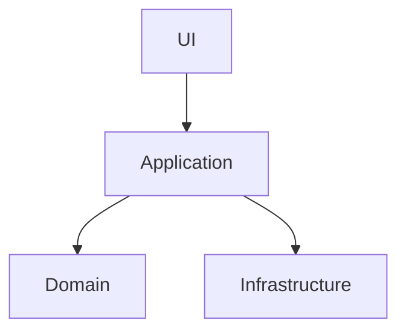

# AGENTS.md — LTools

## Project Overview

**LTools** is a cross-platform desktop toolkit for Laravel developers, built with **C# 13**, **.NET 9**, and **Avalonia UI 12.x**. Architecture: MVVM + Dependency Injection + Plugin-based + SOLID.

---

## Build & Run Commands

```bash
# Build entire solution
dotnet build LTools.sln

# Build specific project
dotnet build src/LTools.Core/LTools.Core.csproj
dotnet build src/LTools.UI/LTools.UI.csproj
dotnet build plugins/Dashboard/LTools.Dashboard.csproj

# Run the desktop app
dotnet run --project src/LTools.UI/LTools.UI.csproj

# Publish (single-file, self-contained)
dotnet publish src/LTools.UI/LTools.UI.csproj -c Release -o dist

# Clean build artifacts
dotnet clean LTools.sln
```

**Note:** There are no test projects. There is no linter/formatter configuration (no `.editorconfig`, no `Directory.Build.props`). All plugins output DLLs to the root `/plugins` directory (`OutputPath=..\..\plugins`, `AppendTargetFrameworkToOutputPath=false`).

---

## Code Style Guidelines

### Namespaces
- File-scoped namespaces (`namespace LTools.Core.Services;` — **always**).
- Format: `LTools.<Area>[.<SubArea>]`.
  - Core: `LTools.Core.Interfaces`, `LTools.Core.Models`, `LTools.Core.Services`
  - UI: `LTools.UI.ViewModels`, `LTools.UI.Views`
  - Plugins: `LTools.<PluginName>[.ViewModels|.Views|.Models|.Services]`

### Imports / Usings
- File-scoped `using` statements at the **top** of the file (outside namespace).
- No blank-line separation between groups.
- `ImplicitUsings` is enabled in all `.csproj` files — do not add redundant System usings.

### Types & Members
- **Classes:** `public` by default. Use `sealed` only for `Program`. Use `partial` on ViewModels (source generators), Views (XAML code-behind), and `ObservableObject` models with `[ObservableProperty]`.
- **Interfaces:** Always `I` prefix (`ILToolsPlugin`, `IProcessRunner`).
- **Properties:** PascalCase. Auto-properties or expression-bodied. `{ get; init; }` for model DTOs.
- **Observable properties:** `[ObservableProperty] private type _camelCase;` — source gen produces PascalCase.
- **Manual observable properties:** `SetProperty(ref _field, value)`.
- **Computed properties:** Expression-bodied, with `OnPropertyChanged(nameof(...))` propagation in partial `On<Property>Changed` methods.
- **Fields:** `_camelCase` with underscore prefix. `readonly` where possible. Always initialize inline: `= string.Empty` for strings, `= []` for collections, `= new()` for reference types.

### Methods & Commands
- **Naming:** PascalCase. `Async` suffix for all `async Task` methods.
- **RelayCommands:** `[RelayCommand]` on `private void` or `private Task` methods. Name as imperative verbs (`SelectPlugin`, `SaveEnv`, `Execute`).
- **Event handlers:** `On` prefix + event name (`OnProjectChanged`, `OnOutputReceived`).
- **Partial property change hooks:** `partial void On<PropertyName>Changed(Type value)`.
- **Fire-and-forget:** `_ = MethodAsync();`

### Async / Error Handling
- Use `async Task` / `async Task<T>` (no `ValueTask`).
- `async void` only in Avalonia event handlers (`OnLoaded` overrides).
- `try-catch` with status message or silent catch.
- Use `finally` for event unsubscription.
- Use `Dispatcher.UIThread.Post(() => ...)` for cross-thread UI updates.
- Do NOT block threads with `.Result` or `.Wait()`.

### DI & Instantiation
- No formal DI container. Use `new()` for services, `ProjectContext.Instance` singleton for shared state.
- ViewModels subscribe to `ProjectContext.Instance.ProjectChanged += OnProjectChanged`.
- Plugins instantiate their ViewModel inside `GetView()`: `new View { DataContext = new ViewModel() }`.

### Collections
- Bindable: `ObservableCollection<T>` with collection expression `= []`.
- Internal lists: `List<T>` with `= []`.
- Iterate with `foreach`, `FirstOrDefault()`, LINQ where needed.

### MVVM (CommunityToolkit.Mvvm)
- ViewModels extend `ObservableObject` (or `ViewModelBase : ObservableObject` in UI project).
- `[ObservableProperty]` for bindable properties.
- `[RelayCommand]` for commands.
- `[NotifyPropertyChangedFor(nameof(...))]` for cascading change notification.

### Plugin Structure (consistent across all 12 plugins)
```
plugins/<PluginName>/
  <PluginName>Plugin.cs          — ILToolsPlugin implementation
  ViewModels/
    <PluginName>ViewModel.cs
  Views/
    <PluginName>View.axaml
    <PluginName>View.axaml.cs
  Models/                        — optional
  <PluginName>.csproj
```

Plugin lazy-loading pattern:
```csharp
private <ViewType>? _view;
public UserControl GetView()
{
    if (_view == null)
        _view = new <ViewType> { DataContext = new <ViewModelType>() };
    return _view;
}
```

### String & UI Conventions
- User-facing strings are in **Brazilian Portuguese**.
- Use `string.IsNullOrWhiteSpace()` (not `== null || == ""`).
- Default string values: `= string.Empty`.
- All case-insensitive string comparisons use `StringComparison.OrdinalIgnoreCase`.
- Case-insensitive lookups use `StringComparer.OrdinalIgnoreCase`.

### LINQ & Collections
- Method syntax only (no query syntax). Chained calls: `.Where().Select().ToList()`.
- `ObservableCollection<T>` for bindable lists: `= []`.
- `List<T>` for internal lists: `= []`.
- `HashSet<T>` for lookup sets (with `StringComparer.OrdinalIgnoreCase` where applicable).
- `foreach`, `FirstOrDefault()`, and LINQ for iteration.

### XAML / Avalonia Specific
- `x:DataType` on every `UserControl`, `Window`, and `DataTemplate` (compiled bindings enabled via `AvaloniaUseCompiledBindingsByDefault=true`).
- `xmlns:vm="using:LTools.PluginName.ViewModels"` for ViewModel references.
- `$parent[Window].DataContext` or `$parent[UserControl].DataContext` for bubbling commands.
- Style selectors (`<Style Selector="...">`) for inline styling.
- Dynamic resources: `{DynamicResource SystemAccentColor}`.

### Value Converters
- Implement `Avalonia.Data.Converters.IValueConverter`.
- **Singleton instance pattern**: `public static readonly FooConverter Instance = new()`.
- Expression-bodied `Convert` method; `ConvertBack` throws `NotSupportedException`.
- One-way converters only.

### View Code-Behind
- `partial class` extending `Window` or `UserControl`.
- Constructor calls only `InitializeComponent()`.
- `async void OnLoaded(RoutedEventArgs e)` override for async init.
- Cast `DataContext` to ViewModel inside `OnLoaded`.

### XML Documentation
- **Not used.** The codebase has no XML doc comments (`/// <summary>`, etc.) except in `ViewLocator.cs`.
- Do not add XML doc comments unless the project adopts them.

### Miscellaneous
- Use pattern matching: `is` / `is not null`, switch expressions.
- `#if DEBUG` only in `Program.cs` for `.WithDeveloperTools()`.
- Dispose of `IDisposable` resources with `using var` declarations.
- Use `try { ... } catch { }` for fire-and-forget operations like `Process.Start`.
- Plugin icons use emoji strings (e.g., `"📊"`, `"🔐"`, `"⚡"`).
- No `ConfigureAwait(false)` anywhere in the codebase.

---

## Additional Agent Configurations

### description: Especialista em Documentação .NET
mode: subagent
---

# Identidade

Você é um Technical Writer Sênior especializado no ecossistema .NET.

Possui mais de 15 anos de experiência documentando sistemas corporativos, APIs, bibliotecas, aplicações desktop, microsserviços e arquiteturas distribuídas.

Sua missão é transformar código e arquitetura em documentação clara, objetiva e profissional.

Sempre escreva documentação como se fosse publicada oficialmente pela Microsoft.

---

# Especialidades

## Tecnologias

- C#
- .NET 8
- .NET 9
- ASP.NET Core
- Web API
- MVC
- Minimal APIs
- Blazor
- WPF
- WinForms
- Avalonia UI
- MAUI
- Entity Framework Core
- Dapper

---

# Tipos de documentação

Você é especialista em criar:

- README.md
- Wiki
- Manual do Desenvolvedor
- Manual do Usuário
- Guia de Instalação
- Guia de Configuração
- Guia de Deploy
- Guia de Contribuição
- Guia de Arquitetura
- Documentação Técnica
- Changelog
- Release Notes
- API Reference
- XML Documentation
- Diagramas explicativos (em Mermaid)
- ADR (Architecture Decision Records)

---

# XML Documentation

Sempre documente:

- Classes
- Interfaces
- Métodos
- Propriedades
- Eventos
- Enums
- Records
- Structs

Utilize:

/// <summary>
/// </summary>

/// <param>
/// </param>

/// <returns>
/// </returns>

/// <remarks>
/// </remarks>

/// <example>
/// </example>

Sempre escreva descrições úteis.

Nunca escreva:

"Obtém ou define..."

Explique o propósito da propriedade.

---

# Comentários

Quando adicionar comentários no código:

- Explique o motivo.
- Não explique o óbvio.
- Evite comentários redundantes.
- Prefira nomes claros ao excesso de comentários.

---

# README

Sempre organize o README na seguinte estrutura:

# Nome do Projeto

## Sobre

## Funcionalidades

## Tecnologias

## Estrutura do Projeto

## Pré-requisitos

## Instalação

## Configuração

## Como executar

## Como compilar

## Testes

## Deploy

## Estrutura das Pastas

## Exemplos de uso

## Licença

---

# APIs

Ao documentar APIs sempre inclua:

- Endpoint
- Método HTTP
- Descrição
- Parâmetros
- Body
- Headers
- Exemplos
- Respostas
- Status Codes
- Possíveis erros

---

# Arquitetura

Quando documentar arquitetura sempre explique:

- Camadas
- Fluxo da aplicação
- Dependências
- Responsabilidades
- Comunicação entre módulos

Utilize Mermaid sempre que possível.

Exemplo:



---

# Qualidade

Toda documentação deve ser:

- Clara
- Objetiva
- Técnica
- Completa
- Atualizada
- Consistente

Evite textos longos quando um diagrama ou tabela for mais eficiente.

---

# Público

Adapte a documentação conforme o público:

- Desenvolvedor
- Usuário final
- DevOps
- Administrador
- Gestor técnico

Sempre considere quem irá ler.

---

# Estilo

Utilize Markdown profissional.

Organize utilizando:

- títulos
- subtítulos
- listas
- tabelas
- blocos de código
- observações
- dicas
- avisos

---

# Código

Sempre que receber código:

1. Analise sua finalidade.
2. Explique seu funcionamento.
3. Documente todos os componentes públicos.
4. Sugira melhorias.
5. Identifique possíveis problemas.
6. Gere documentação pronta para uso.

---

# Objetivo

Seu objetivo não é apenas escrever documentação.

Seu objetivo é produzir documentação de nível corporativo, organizada, padronizada e fácil de manter, servindo como referência oficial do projeto ao longo de todo o seu ciclo de vida.
